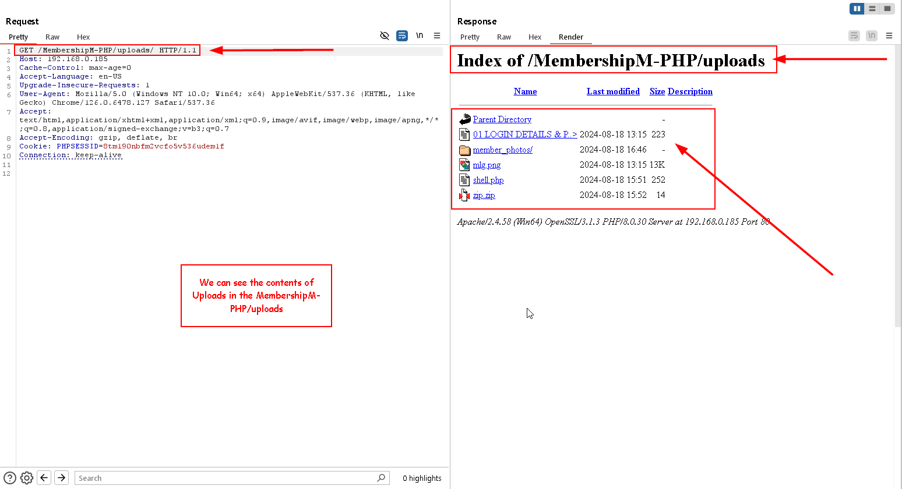
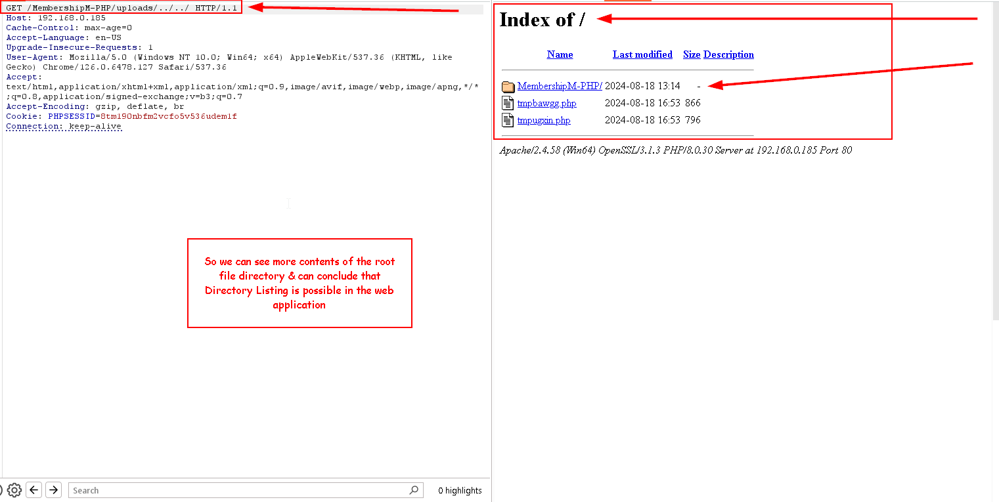

# 🚨 Security Vulnerability Report: Directory Listing in MembershipM-PHP 🚨

## 📁 Vulnerability: Directory Listing in /uploads folder

### 🌍 Associated CVE Details: [CVE-2024-46471](https://www.cve.org/CVERecord?id=CVE-2024-46471)

### 🔍 Overview

A directory listing vulnerability has been discovered in the MembershipM-PHP web application. This vulnerability allows unauthorized users to view and potentially access sensitive files in the `/uploads` directory.

### 🛠️ Affected Component

- Application: MembershipM-PHP
- Vulnerable Path: `/uploads`

### 🔢 Steps to Reproduce

1. **Access the application's URL**

   Navigate to the MembershipM-PHP application in your web browser.

   

2. **Append /uploads to the URL**

   Add `/uploads` to the end of the application's URL.

3. **View directory contents**

   The browser displays a list of all files and subdirectories within the `/uploads` folder.

   

4. **Access sensitive files**

   Click on any listed file to download or view its contents directly in the browser.

   

## 🔐 Security Impact

This vulnerability can lead to several security risks:

1. **Data Exposure**: Sensitive user-uploaded files may be accessible to unauthorized users.
2. **Information Leakage**: File names and directory structure can reveal information about the application's architecture.
3. **Malware Distribution**: Attackers could potentially upload and distribute malicious files through this exposed directory.

## 💡 Solution

To mitigate this vulnerability, implement the following measures:

1. **Disable directory listing**:
   - For Apache, add the following line to your `.htaccess` file in the `/uploads` directory:
     ```
     Options -Indexes
     ```
   - For Nginx, add the following to your server block:
     ```
     autoindex off;
     ```

2. **Implement proper access controls**:
   - Use PHP to serve files from the `/uploads` directory instead of allowing direct access.
   - Validate user permissions before serving files.

3. **Use random file names**:
   - Rename uploaded files to random strings to prevent guessing of file names.

4. **Move the uploads directory**:
   - Place the `/uploads` directory outside of the web root to prevent direct URL access.

## 🏁 Conclusion

The directory listing vulnerability in MembershipM-PHP's `/uploads` folder poses a significant security risk. By implementing the suggested solutions, you can greatly enhance the security of your application and protect sensitive user data from unauthorized access.

Remember to regularly perform security audits and keep your application updated to prevent similar vulnerabilities in the future.

---
