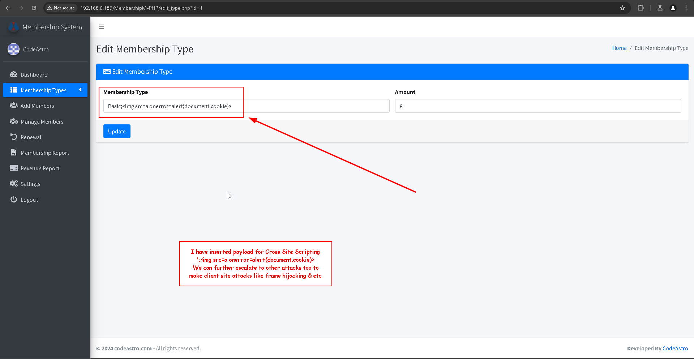
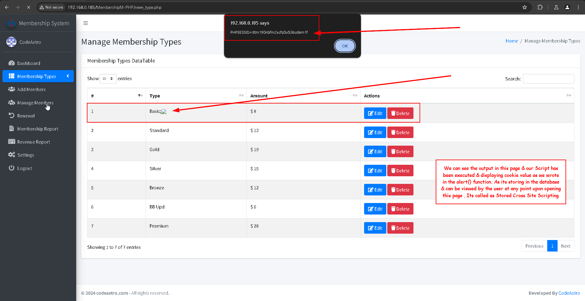

# 🚨 Stored XSS Vulnerability in `MembershipM-PHP` on `edit-type.php`

### 🌍 Associated CVE Details: [CVE-2024-46470](https://www.cve.org/CVERecord?id=CVE-2024-46471)

## 📄 Description
A stored **Cross-Site Scripting (XSS)** vulnerability was discovered on the Membership Type management page (`MembershipM-PHP/edit-type.php`). Malicious scripts can be injected into the **membership type** field and stored in the database. This leads to the possibility of a stored XSS attack, which can compromise the integrity and security of the web application.

### 🌍 Affected File:
- **File:** `edit-type.php`
- **Parameter:** `membership_type` input field
- **Vulnerability Type:** Stored XSS

---

## 🧑‍💻 Steps to Reproduce

1. **Navigate to the "View Membership Type" page:**
   - URL: `MembershipM-PHP/view-type.php`

    
   
2. **Inject Malicious Script into Membership Type Field:**
   - Enter the following payload in the **Membership Type** field:
     ```html
     Basic;
     ```
   - Save the membership type.

   
   

3. **Go to "View Membership Types" page:**
   - URL: `MembershipM-PHP/view-type.php`
   - The previously injected script will execute when the page loads, causing a JavaScript alert popup.

   

---

## 🛑 Impact
- **Data Theft:** Attackers can steal sensitive data such as session cookies.
- **Session Hijacking:** Malicious scripts can hijack user sessions.
- **Phishing Attacks:** Attackers can redirect users to phishing pages.
- **Defacement:** Attackers can alter the web page appearance.

---

## 🔒 Solution

1. **Input Validation:**
   - Ensure proper input validation to filter out any JavaScript or HTML tags:
     ```php
     $membership_type = htmlspecialchars($input, ENT_QUOTES, 'UTF-8');
     ```

2. **Output Encoding:**
   - Ensure the output is encoded before rendering it on the webpage.

3. **Use Content Security Policy (CSP):**
   - Set a CSP header to prevent the execution of malicious scripts:
     ```http
     Content-Security-Policy: script-src 'self';
     ```

4. **Sanitize User Input:**
   - Use libraries like **HTML Purifier** to sanitize the inputs:
     ```php
     $purifier = new HTMLPurifier();
     $clean_html = $purifier->purify($input);
     ```

---

## 🧑‍🔧 Conclusion

This stored XSS vulnerability in `MembershipM-PHP` allows attackers to persistently inject malicious scripts. It can affect all users accessing the page and lead to significant security risks. Implementing proper input validation, output encoding, and a secure CSP policy will mitigate this vulnerability and prevent future exploitation.

---